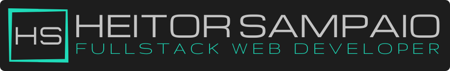
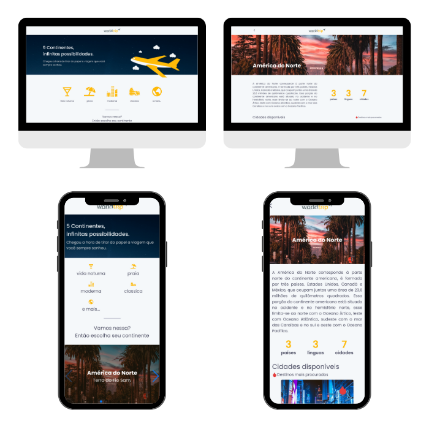

<p align="center">
  
</p>

<p align="center">
  🤓 <strong>WELCOME</strong> 🤓
</p>

---

## About this project 🔎

<p align="center">
  
</p>

🚀 **upfy** is image uploader service.

You can use upfy to upload your favorites images to cloud backup, or, just to easily share with your friends!

🌐 **This application is live in [Vercel](https://vercel.com/) and you can acess it by clicking [here](https://upfy.vercel.app/).**

## Motivation 💪

This is a [Rocketseat's Ignite](https://www.rocketseat.com.br/ignite) code challenge where they provided a [layout sample](<https://www.figma.com/file/LoWnp5LHd4e81nBM3cCo56/Desafio-1-M%C3%B3dulo-4-ReactJS-(Copy)?node-id=0%3A1>) and a base code to be implemented and improved using ReactJS, Next.js and ChakraUI.
These type of code challenges are perfect oportunities to improve development skills, try out new technologies and build "real world" applications, since there is a need to match certain "client" requirements.

<!-- ## Sneak peek 👀

<div align="center">
  
</div> -->

## Under de hood 🛠

<p align="center">
  
</p>

<p align="center">
  
  
  
  
</p>
<p align="center">
  
  
  
  
<p>

This is a [Next.js](https://nextjs.org/) project with [ChakraUi](https://chakra-ui.com/).

Next.js is a ReactJS framework that allows serveless applications building.

ChakraUI is a ReactJS component library that represent the future of interface building, allowing to build well-designed, responsive and acessible user interfaces with ease.

I also used [Axios](https://axios-http.com/) as HTTP client to consume a **Next API** to get and post images in [imgbb](https://imgbb.com/) images service and save informations from each image in a [Fauna](https://fauna.com/) database.

This project use [ReactQuery](https://react-query.tanstack.com/) to cache images requests results to avoid excessive API calls and improve user experience.

To provide better code maintainability, this project was built with [TypeScript](https://www.typescriptlang.org/).

## Features 🔥

- Dynamic page building with data fetched from API
- Accessibility for screen readers
- Image upload
- Cached API requests results to improve user experience

## Planned features 🧭

- [ ] Account creation
- [ ] My images section
- [ ] Collections
- [ ] Favorites images
- [ ] Easy share button
- [ ] Surprise me! (Get random image)
- [ ] Filters

## Running localy 💻

If you wish, you can run this project locally.

1. First, [install Node.js v16.14.2](https://nodejs.org/download/release/v16.14.2/).

2. Download or clone this project from this GitHub repository to your local storage.

3. Open the project folder in your code editor or terminal.

4. Install project dependencies:

```bash
npm install
# or
yarn
```

5. Run the development server locally:

```bash
npm run dev
# or
yarn dev
```

6. Open [http://localhost:3000](http://localhost:3000) with your browser to see the result.

<!-- ## Consuming the API externally 🌐

With development server running locally, the API route can be accessed on [http://localhost:3000/api](http://localhost:3000/api/hello).

This endpoint returns a JSON format object with all continents, countries and cities data. -->

## Updates Log 📝

- **v0.0.1 - 08/06/22 | First commit**

## Want to contribute? 🚀

Lets work together! Feel free to contribute on this project.

<p align="center">
  
</p>

---

<p align="center">
  
</p>
<p align="center">
LET'S WORK TOGETHER! 🤝
</P>
<p align="center">
  Get in touch<br/>
  <a href="https://www.linkedin.com/in/heitor-sampaio/">
    
  </a>
  <a href="https://api.whatsapp.com/send?phone=5548991543707">
    
  </a>
  <a href="https://t.me/HeitorSampaio">
    
  </a>
  <a href="mailto:heitorosampaio@gmail.com">
    
  </a>
</p>
